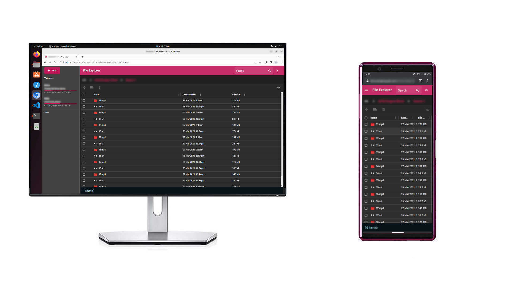

# RPi Drive

  

A cloud drive based on [Django](https://www.djangoproject.com/) & [MUI](https://www.mui.com/).

## Features

- File browser with CRUD & search functionality
- Audio preview with metadata & album art
- Picture/video/code preview
- Dedicated media player with playlist support on audio/video
- Designed & optimized for running on Raspberry Pi devices with 1GB RAM or more

## Development Guide

Visit [here](./user-doc/development)

## Deployment & FAQ

Visit [here](./user-doc/deployment)
